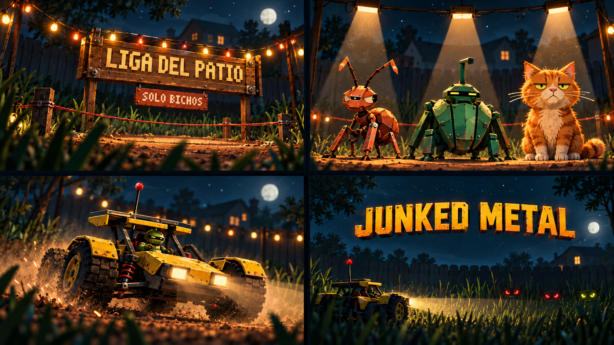

# Junked Metal — Intro y recursos visuales

Fecha: 2026-10-10. Estado: **acabado cinematográfico aprobado; producción de escenas y personajes separados en curso; integración fuera de esta tanda**.

## Alcance acordado

Decisiones del usuario en esta sesión:

- Intro + inventario de recursos reutilizables para Supervivencia, Carrera y Junket Crush. Primera producción concentrada en la intro.
- Conservar la noche y la historia: cartel de la liga, presentación de rivales, entrada del auto RC y cierre.
- Mostrar una lámina/storyboard antes de reemplazar recursos en el juego.
- Tras ver la muestra, el usuario eligió conservar su acabado cinematográfico y producir escenas y personajes separados con ese nivel de detalle. La intro puede ser más elaborada que el gameplay; no se pide simplificar esta tanda a píxeles grandes.

Responsabilidad: ilustraciones, texturas, modelos y puesta en escena visual. La presente tanda no modifica código, gameplay, balance, física, audio ni interfaz. No publica ni integra la propuesta.

## Estado real investigado

- Dirección vigente: [`ART_DIRECTION.md`](ART_DIRECTION.md), día + mundo Folded de metal plegado, paleta industrial, materiales gastados y Rajdhani. La noche de la intro es una excepción conservada por la guía y ratificada por el usuario.
- Intro efectiva: [`src/intro.ts`](../src/intro.ts), canvas 192×108 sin imágenes externas; cuatro escenas de 5 / 5 / 5,2 / 4,4 segundos, total **19,6 segundos**. La historia vigente en código es la liga del patio, no la casa que apaga sus luces descrita en un apartado antiguo de la guía.
- Presentación: [`src/intro.css`](../src/intro.css), escena 16:9, subtítulos y logo fuera del dibujo. `playIntro`, teclado, toque, gamepad y modo calmo deben conservarse en una futura integración. [`src/main.ts`](../src/main.ts) ofrece `?intro`; la reproducción automática efectiva ocurre en cargas sin `mute`/`lab`, aunque comentarios antiguos describen solo el primer arranque.
- Capturas nuevas: cuatro escenas en `.shots/investigacion-arte/intro-{cartel,rivales,auto,cierre}.png`, contra pm2 `rc-test` :5174, Chromium headless con Metal y audio desactivado. Navegador cerrado al terminar; sin errores `pageerror`. No hay aún escenario de intro en `scripts/scenarios.mjs`.
- Capturas existentes de portada, Junket Crush y Carrera revisadas como contexto; no constituyen validación nueva de esos modos.
- Modelos activos: `FOLDED_SLICE = true` en [`src/folded.ts`](../src/folded.ts); `PROC`, `PETS` y `carHull` en `src/folded_slice.ts`. `src/carGlb.ts` omite cargar los GLB de autos en este estado; `src/glb.ts` hornea las plantillas Folded. Retocar únicamente los `.blend`/GLB antiguos no cambia los modelos activos.
- Ya existen materiales, atlas, calcos, utilería y geometría reutilizables en `folded.ts` y `kit3d.ts`. Inventario anterior: [`ASSET_INVENTORY.md`](ASSET_INVENTORY.md).
- Blender local confirmado por CLI: **5.2.2 LTS**, `/Applications/Blender.app`. Hay scripts editables de construcción/exportación en `assets-src/`. No se produjo todavía ningún modelo nuevo.

## Muestra producida

Archivo: [`intro-storyboard-v1.png`](images/intro-storyboard-v1.png). Generado con la herramienta integrada `image_gen`, usando las cuatro capturas nuevas de la intro y la captura existente del buggy en portada. Prompt exacto: [`intro-storyboard-v1.prompt.txt`](images/intro-storyboard-v1.prompt.txt).

La lámina propone composición, luz, profundidad y materiales. **Es una imagen conceptual: no contiene geometría 3D, capas independientes ni animación.** Las formas y materiales generados deben ajustarse a los modelos canónicos durante la producción.

Límites visibles antes de convertirla en recursos finales:

- Tiene más detalle, desenfoque y pelo que el render actual. El usuario aprobó esta diferencia para la intro; el gameplay no cambia de dirección artística.
- Los bichos sugieren una lectura más mecánica que algunas criaturas actuales. Confirmar su fidelidad con `PROC` y con la quitina vigente antes de reemplazarlos.
- El buggy amarillo evita grandes paneles rojos del jugador, pero el generador añadió pequeños acentos rojos. Respetar en producción la regla rojo = amenaza enemiga, sin cambiar por esta muestra los colores del juego.
- El título generado explora volumen; el cierre final debe conservar el branding y la tipografía existentes.
- Los carteles españoles son referencias heredadas de la intro actual. La guía vigente pide inglés para textos del mundo: resolver ese ajuste al preparar los carteles finales; textos y logo no deben quedar horneados en el fondo.

## Producción propuesta de la intro

| Momento existente | Mejora visual | Recursos a producir | Movimiento propuesto |
|---|---|---|---|
| Cartel / 0–5 s | Cámara a ras del pasto; ring de metal con profundidad y luces cálidas | Fondo por planos, cartel sin texto, cuerda, guirnalda y pasto frontal | Desplazamiento lento entre planos; encendido de focos |
| Rivales / 5–10 s | Siluetas fieles, poses con actitud y lectura bajo tres focos | Hormiga, escarabajo y Eulalio por separado; fondo compartido | Entrada breve, asentamiento y gesto sutil; sin horror ni parpadeo obligatorio |
| Auto / 10–15,2 s | Buggy canónico, ruedas legibles, polvo y frenada con peso | Buggy con transparencia y estados de ruedas; reutilizar fondo y efectos existentes | Entrada y frenada existentes; separar ruedas y carrocería si el arte lo necesita |
| Cierre / 15,2–19,6 s | Faro revela rivales; espacio claro para logo y subtítulo | Fondo nocturno, pasto frontal, buggy pequeño y ojos | Barrido suave de luz; logo actual superpuesto |

Ruta de menor costo para esta intro: **ilustraciones por capas y animación ligera sobre la presentación existente**. Mantener cuatro momentos y duración actual como punto de partida. Un video MP4 o una escena 3D nueva no son necesarios para lograr esta primera mejora. Si se elige prerender 3D, usar Blender para las imágenes y animaciones; no sumar otro motor en runtime.

Para esta producción se conservan los PNG fuente cinematográficos a la resolución entregada por el generador, con transparencia real en personajes. La resolución de distribución, peso y formato se fijarán al integrar y probar escritorio/teléfono: no reducir automáticamente al canvas de 192×108. La lámina completa no es un atlas listo para cargar en el juego.

## Inventario de recursos reutilizables

Prioridad 1 = primera producción de intro; prioridad 2 = una tanda posterior elegida por el usuario. Reutilizar una identidad visual no significa que una imagen de intro sea automáticamente una textura de juego.

| Prioridad | Recurso | Entrega propuesta | Reuso y límite |
|---|---|---|---|
| 1 | Patio nocturno por planos | Fondos + primer plano con transparencia, tamaños de escritorio/teléfono revisados | Intro, ilustraciones de carga o créditos; el gameplay sigue de día |
| 1 | Buggy y tres rivales | Recortes separados + hoja de poses, basados en modelos actuales | Intro, ilustraciones promocionales y fichas; no reemplazan plantillas 3D |
| 1 | Cartel, guirnalda, cuerda, focos | Lámina de utilería; recortes o render de objetos separados | Ring de intro; geometría posterior útil en decorado de Carrera |
| 2 | Chapa pintada, bordes, rejillas y goma | Fuentes editables + atlas compatibles con FOLD/TRIM | Los tres modos; ampliar el atlas vigente, sin otra familia de materiales |
| 2 | Calcos y carteles industriales | Arte separado y atlas compatible con DECALS | Taller, gabinete de Crush, Carrera y props; conservar legibilidad y textos del mundo |
| 2 | Utilería 3D de liga y taller | `.blend` + GLB de objetos estáticos, UV/materiales y vistas a 360° | Preferir adaptar KIT/geoKit existentes; no duplicar cajas, barriles ni herramientas ya resueltos |

Capacidades disponibles: generación de imágenes y transparencia con `image_gen`; modelado procedural, materiales, cámaras, animación y exportación mediante scripts de Blender local. **No se verificó ni se propone todavía un servicio neuronal de imagen-a-3D.** Una referencia generada requiere trabajo de geometría y optimización para convertirse en un modelo jugable.

## Límites de integración y verificación posterior

Antes de código: elegir la dirección de esta muestra y cerrar el formato de producción. Arte final debe venir separado en recursos, no como una lámina única. Cambios de modelos deberán conservar pivotes, escala, colisión, clips y el horneado VAT; probar 360° y cámaras reales. No tocar archivos de otros especialistas para producir una muestra.

Integración de intro alcanzaría `intro.ts`, su presentación si hiciera falta y un escenario headless de las cuatro escenas; revisar llamadas de `playIntro`, silencio, modo calmo, subtítulos, logo, salida y posibles fallos de carga. Usar recursos relativos para GitHub Pages. Verificación al final de esa tanda: `tsc`, `npm test`, `build`, capturas pc/cel y prueba de reproducción/salto. Medir arranque si se agregan descargas; evaluar rendimiento si se cambia la escena 3D.

Esta tanda solo produjo documentación y una imagen conceptual. No se corrieron suites de código, simulación ni medición de rendimiento; no hay afirmación de mejora integrada ni de calidad 3D comprobada. Siguiente decisión: evaluación artística de la lámina; todavía no autoriza sustituir recursos.
